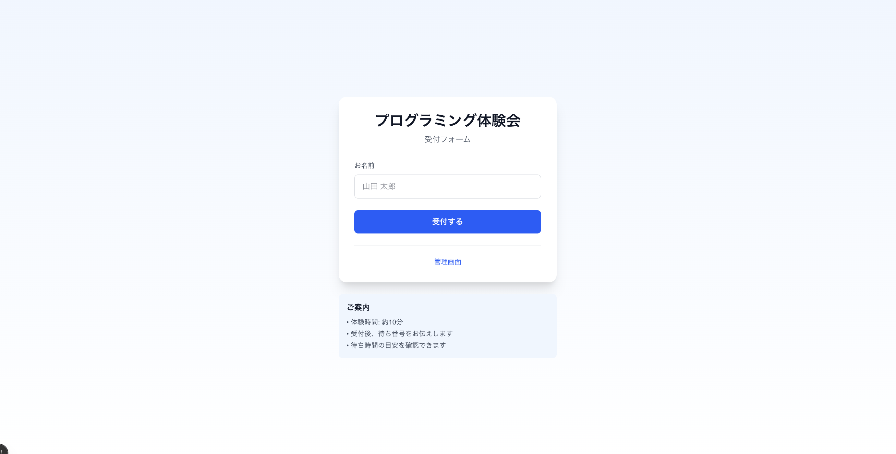
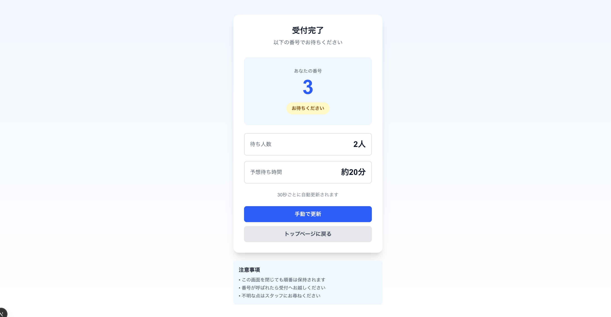
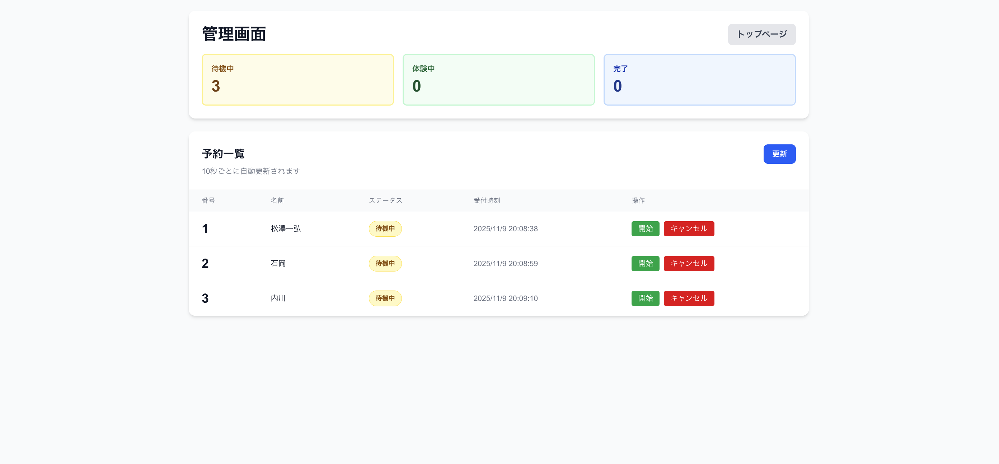

# プログラミング体験会 受付管理アプリ

体験会の申し込みを管理し、待ち番号と待ち時間を表示する Web アプリケーションです。

## 機能

### ユーザー向け機能
- ✅ 名前を入力して受付
- ✅ 待ち番号の表示
- ✅ 待ち人数と予想待ち時間の表示（リアルタイム更新: 10秒ごと）
- ✅ **各席（A席、B席、C席）の状況をプログレスバーで表示**
  - 利用者名と残り時間を視覚的に表示
  - 体験開始時刻を考慮した正確な残り時間計算

### 管理者向け機能
- ✅ 全予約の一覧表示
- ✅ ステータス管理（待機中 → 体験中 → 完了）
- ✅ **同時に最大3人まで体験可能**（上限チェック機能付き）
- ✅ キャンセル機能
- ✅ 統計情報の表示（待機中、体験中、完了の人数）

## スクリーンショット

### 受付フォーム
ユーザーは名前を入力して体験会に申し込みます。



### 待ち状況画面
受付完了後、ユーザーは自分の待ち番号と予想待ち時間を確認できます。



### 管理画面
スタッフは全予約の状況を確認し、ステータスを管理できます。



## 技術スタック

### フロントエンド
- **Next.js 15** (App Router)
- **TypeScript**
- **Tailwind CSS**

### バックエンド
- **Python 3.x**
- **FastAPI**
- **Supabase** (PostgreSQL)

## プロジェクト構造

```
reservation-app/
├── frontend/          # Next.js フロントエンド
│   ├── app/
│   │   ├── page.tsx          # 受付フォーム
│   │   ├── wait/[queue_number]/page.tsx  # 待ち状況画面
│   │   └── admin/page.tsx    # 管理画面
│   └── types/
│       └── reservation.ts    # 型定義
│
└── backend/           # Python FastAPI バックエンド
    ├── main.py        # API実装
    ├── schema.sql     # データベーススキーマ
    ├── requirements.txt
    └── README.md
```

## セットアップ

### 1. Supabase のセットアップ

1. [Supabase](https://supabase.com/) でアカウント作成とプロジェクト作成
2. SQL Editor で `backend/schema.sql` の内容を実行
3. Project Settings → API から以下を取得：
   - `SUPABASE_URL`
   - `SUPABASE_KEY` (anon/public key)

### 2. バックエンドのセットアップ

```bash
cd backend

# 仮想環境の作成と有効化
python3 -m venv venv
source venv/bin/activate  # Windows: venv\Scripts\activate

# 依存関係のインストール
pip install -r requirements.txt

# 環境変数の設定
cp .env.example .env
# .env ファイルを編集して Supabase の認証情報を設定

# サーバーの起動
python main.py
```

バックエンドは http://localhost:8000 で起動します。

API ドキュメント: http://localhost:8000/docs

### 3. フロントエンドのセットアップ

```bash
cd frontend

# 依存関係のインストール
npm install

# 開発サーバーの起動
npm run dev
```

フロントエンドは http://localhost:3000 で起動します。

## 使い方

### ユーザー側の操作

1. トップページ (http://localhost:3000) で現在の待ち状況を確認
   - 待機中の人数
   - 体験中の人数
   - 予想待ち時間
   - **各席（A席、B席、C席）の利用状況と残り時間**
2. 名前を入力して受付
3. 待ち番号が表示される画面に自動遷移
4. 待ち人数と予想待ち時間を確認
5. 画面は自動更新される（トップページ: 10秒、待ち状況画面: 30秒）

### 管理者側の操作

1. 管理画面 (http://localhost:3000/admin) にアクセス
2. 統計情報を確認（待機中、体験中、完了の人数）
3. 予約一覧を確認
4. 各予約のステータスを更新：
   - 「開始」ボタン: 待機中 → 体験中（**最大3人まで同時に体験可能**）
   - 「完了」ボタン: 体験中 → 完了
   - 「キャンセル」ボタン: キャンセル状態に変更
5. 画面は10秒ごとに自動更新

**注意**: 体験中が既に3人の場合、4人目を開始しようとするとエラーメッセージが表示されます。

## API エンドポイント

### 予約作成
```
POST /reservations
Body: {"name": "名前"}
```

### 全予約取得（管理者用）
```
GET /reservations
```

### 待ち状況取得
```
GET /reservations/{queue_number}/wait-info
```

### 統計情報取得（トップページ用）
```
GET /stats
Response: {
  "waiting_count": 3,
  "in_progress_count": 2,
  "completed_count": 5,
  "estimated_wait_minutes": 10,
  "seats": [
    {"seat_name": "A席", "name": "佐藤", "remaining_minutes": 8.5},
    {"seat_name": "B席", "name": "高橋", "remaining_minutes": 5.2}
  ]
}
```

### ステータス更新（管理者用）
```
PATCH /reservations/{queue_number}
Body: {"status": "in_progress"}
```

ステータス: `waiting`, `in_progress`, `completed`, `cancelled`

**注意**: 体験中が既に3人の場合、`in_progress` への更新は 400 エラーを返します。

## データベーススキーマ

### reservations テーブル

| カラム名 | 型 | 説明 |
|---------|-----|------|
| id | UUID | 主キー |
| queue_number | SERIAL | 待ち番号（自動採番） |
| name | TEXT | 名前 |
| status | TEXT | ステータス |
| created_at | TIMESTAMP | 作成日時 |
| started_at | TIMESTAMP | 開始日時 |
| completed_at | TIMESTAMP | 完了日時 |

## カスタマイズ

### 体験時間の変更

`backend/main.py` の以下の部分を編集：

```python
EXPERIENCE_DURATION_MINUTES = 10  # 分単位で変更
```

### 同時受入人数の変更

`backend/main.py` の以下の部分を編集：

```python
MAX_CONCURRENT_EXPERIENCES = 3  # 同時に体験できる最大人数を変更
```

変更後、待ち時間の計算やバリデーションが自動的に調整されます。

**例**: 5人まで同時対応にする場合は `MAX_CONCURRENT_EXPERIENCES = 5` に変更

## 開発

### バックエンドの開発

```bash
cd backend
source venv/bin/activate
uvicorn main:app --reload
```

### フロントエンドの開発

```bash
cd frontend
npm run dev
```

## ライセンス

MIT

## サポート

問題が発生した場合は、以下を確認してください：

1. Supabase の認証情報が正しく設定されているか
2. バックエンドとフロントエンドが両方起動しているか
3. 環境変数が正しく設定されているか
